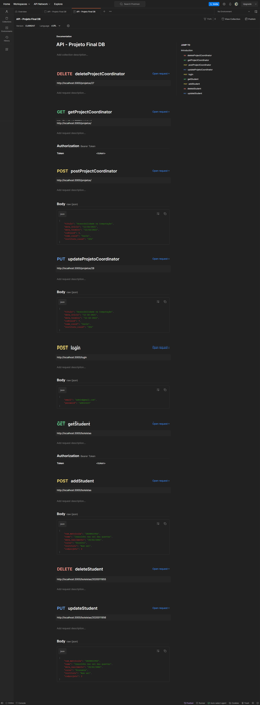

# Sistema de Gestão de Projetos

O Sistema de Gestão de Projetos (SGP) é uma aplicação de backend desenvolvida em Node.js que oferece um CRUD para projetos, bolsistas e coordenadores, além de gerenciar suas relações. O Frontend do Sistema de Gestão de Projetos (SGP) está localizado neste [link](https://github.com/salomao-marcioliver/Frontend---SGP).

## Pré-requisitos

Antes de executar o projeto, certifique-se de ter o Node.js instalado em seu sistema. Você pode baixá-lo em [nodejs.org](https://nodejs.org/).

## Instalação

Para configurar e executar o projeto, siga estas etapas:

1. Clone o repositório:

   ```bash
   git clone https://github.com/salomao-marcioliver/Backend---SGP.git
   cd Backend---SGP

2. Instale as dependências do projeto usando npm:

   ```bash
   npm install
   ```

3. Execute o seguinte script SQL em um Gerenciador de Banco de dados (pgAdmin, HeidiSQL, DBeaver...):
    ```bash
    create table bolsista (
      num_matricula bigint primary key not null,
      nome varchar (100),
      curso varchar (100),
      data_nascimento date,
      instituto varchar(100),
      codprojeto int, 
      foreign key(codprojeto) references projeto_coordenador(codprojeto) 
    );


    create table projeto_coordenador (
      codprojeto serial primary key not null,
      titulo varchar(100),
      data_inicio date,
      data_termino date,
      codcoord int,
      nome_coord varchar(100),
      instituto_coord varchar(100)
    );
    ```
  
## Uso
Para iniciar o servidor, execute o seguinte comando:

```bash
 npm start
```
O servidor estará acessível em http://localhost:3000 por padrão. Você pode alterar a porta no arquivo de configuração, se necessário.

## Rotas




##### Certifique-se de explorar as rotas e usar um cliente REST (como o Postman) para testar as funcionalidades.